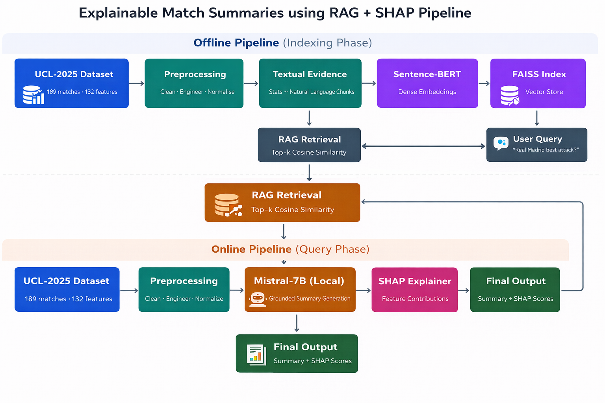

# 🏆 Explainable Match Summaries — RAG + SHAP + Mistral-7B

<div align="center">


**Generates factually grounded, explainable football match summaries by combining Retrieval-Augmented Generation (RAG) with SHAP — no hallucinations, no black boxes.**

[Features](#-features) • [How It Works](#-how-it-works) • [Results](#-results) • [Installation](#-installation) • [Usage](#-usage) • [Architecture](#-architecture) • [Tech Stack](#-tech-stack) • [Contact](#-contact)

</div>

---

## 📌 Overview

General-purpose LLMs produce fluent football summaries but hallucinate statistics. Ask one about a specific match — it might get the winner right but fabricate the scoreline, goalscorers, or disciplinary events. This project fixes that.

**Explainable Match Summaries** grounds every summary in verified UCL-2025 match statistics using a RAG pipeline, and adds a SHAP explainability layer so analysts can see exactly which features drove the model's assessment — all running locally with no paid API.

Three core contributions:
- 📚 **Self-Curated UCL-2025 Dataset** — 189 UEFA Champions League 2025 matches, 142 columns per match, **manually collected by the author directly from the official UEFA website (uefa.com)** — independent of any previously published database or third-party data provider
- 🔍 **RAG Pipeline** — Sentence-BERT + FAISS retrieval feeds verified match facts directly into the Mistral-7B prompt, eliminating hallucination within the knowledge base scope
- 📊 **SHAP Explainability** — LinearExplainer over key match features surfaces which stats most influenced the generated summary

---

## 📂 Dataset

> ⚠️ **Original Dataset — Do Not Confuse With Third-Party Sources**
>
> The `UCL-2025_Team_Stats.xlsx` file included in this repository was **independently curated by the author** by manually collecting match statistics directly from the **official UEFA website ([uefa.com](https://www.uefa.com))** across all stages of the 2024/25 UEFA Champions League season. It is **not derived from Opta, StatsBomb, or any other third-party data provider** and was first published as part of this project.

| Property | Value |
|---|---|
| Matches | 189 |
| Columns | 142 |
| Phases | League Phase, Play-Off, Round of 16, Quarter-finals, Semi-finals, Final |
| Source | Official UEFA website (manually collected) |
| Missing values | 0 |
| Duplicates | 0 |

Stats covered: goals, shots, shots on target, possession, assists, passes, passing accuracy, fouls, yellow/red cards, xG, corners, offsides, attacks, clear chances.

---

## ✨ Features

### 🔍 RAG Pipeline
- Match stats converted to natural language evidence chunks per match
- Sentence-BERT `all-MiniLM-L6-v2` encodes 189 evidence strings → 384-d dense vectors
- FAISS `IndexFlatL2` stores and retrieves top-k most semantically similar matches
- Retrieved evidence inserted into a structured prompt — Mistral-7B can only use verified facts
## 🔄 Pipeline



### 🤖 Local Mistral-7B Inference
- `Mistral-7B-Instruct-v0.2` in Q4_K_M quantized form via `llama.cpp`
- Runs fully on CPU — no GPU required, no paid API
- Temperature = 0.2 for factual consistency over creative diversity
- Context window = 2048 tokens

### 📊 SHAP Explainability
- LinearRegression proxy fitted on 4 key match features (goals scored, goals conceded, goal diff, win indicator)
- SHAP LinearExplainer computes per-match feature attributions
- Global importance ranking + per-match waterfall plots

### 📈 Exploratory Data Analysis
- Goals distribution by tournament phase and match outcome
- Top 12 teams by total goals scored
- Possession vs match outcome analysis
- Pearson correlation heatmap of home team match statistics
- Attacking efficiency — shots on target vs goals per team

---

## 🖥️ Demo

### RAG vs Baseline
```
Query   → "Barcelona's highest-scoring match?"

Baseline LLM → Fabricates a scoreline not present in the dataset ❌

RAG Output  → "Barcelona vs Benfica in the League Phase.
               Barcelona scored 4 goals, Benfica scored 5.
               The winner was Benfica." ✅ (traced to UCL-2025 record)
```

### SHAP Feature Attribution
```
Match   → Real Madrid 5 - 2 Borussia Dortmund
Top feature → Goal Difference (+3): SHAP = +1.00
              Goals Scored (5):     SHAP = +0.31
              Goals Conceded (2):   SHAP = -0.31
```

---

## 🚀 Installation

### Prerequisites
- Python 3.10 or higher
- `Mistral-7B-Instruct-v0.2.Q4_K_M.gguf` model file (download separately)
- CPU is sufficient — no GPU needed

### Step 1 — Clone the Repository
```bash
git clone https://github.com/bk1210/explainable-match-summaries.git
cd explainable-match-summaries
```

### Step 2 — Install Dependencies
```bash
pip install -r requirements.txt
```

### Step 3 — Download the Mistral-7B Model
Download the quantized model from HuggingFace:
👉 [Mistral-7B-Instruct-v0.2 GGUF](https://huggingface.co/TheBloke/Mistral-7B-Instruct-v0.2-GGUF)

Place `mistral-7b-instruct-v0.2.Q4_K_M.gguf` in the project root.

### Step 4 — Run the Notebook
```bash
jupyter notebook Code.ipynb
```

---

## 📖 Usage

### Running the Full Pipeline

Open `Code.ipynb` and run all cells — the notebook handles:

1. Loading `UCL-2025_Team_Stats.xlsx` (189 matches, 142 columns)
2. EDA — goals distribution, top scorers, possession analysis, correlation heatmap
3. Evidence builder — converts each match row to a natural language string
4. Sentence-BERT embedding + FAISS indexing (189 × 384-d vectors)
5. RAG retrieval function (top-k=3 by L2 similarity)
6. Mistral-7B grounded summary generation
7. SHAP LinearExplainer — global + per-match feature importance

### Query the System
```python
query = "Real Madrid best attacking performance?"
summary = generate_summary(query, k=3)
print(summary)
# → Grounded output citing only verified UCL-2025 facts
```

---

## 🏗️ Architecture

### Full Pipeline

```
UCL-2025 Dataset (189 matches, 142 columns)
[Manually curated from uefa.com by the author]
    │
    ▼
── OFFLINE PIPELINE (Indexing) ──────────────────────
    │
    ▼
Evidence Builder
["Match between Real Madrid and Dortmund. Real Madrid scored 5..."]
    │
    ▼
Sentence-BERT (all-MiniLM-L6-v2) → 384-d dense embeddings
    │
    ▼
FAISS IndexFlatL2 → Vector store of 189 match embeddings

── ONLINE PIPELINE (Query) ───────────────────────────

User Query → Sentence-BERT encode → FAISS top-k retrieval
    │
    ▼
Retrieved Evidence (top-3 most similar matches)
    │
    ▼
Structured Prompt → Mistral-7B-Instruct (local, Q4_K_M, CPU)
    │
    ▼
Grounded Match Summary
    │
    ▼
SHAP LinearExplainer → Feature Importance Scores
    │
    ▼
Final Output: Summary + SHAP Attribution
```

### Project Structure

```
explainable-match-summaries/
│
├── Code.ipynb                        # Full pipeline — EDA, RAG, Mistral, SHAP
├── UCL-2025_Team_Stats.xlsx          # Original self-curated UCL 2025 dataset
├── viz_08_rag_pipeline.png           # RAG + SHAP pipeline diagram
├── requirements.txt                  # Python dependencies
└── README.md                         # Project documentation
```

---

## 📊 Results

### RAG Retrieval Quality

| Metric | RAG (Top-k) | Random Baseline |
|---|---|---|
| Mean cosine similarity | **0.903** | 0.373 |
| Standard deviation | 0.048 | 0.082 |
| Proportion ≥ 0.7 | **100%** | < 5% |

### SHAP Feature Importance

| Feature | Mean \|SHAP\| | Direction |
|---|---|---|
| Goal Difference | **1.000** | Positive |
| Goals Scored | 0.312 | Positive |
| Goals Conceded | 0.310 | Negative |
| Binary Win Indicator | 0.089 | Positive |

### System Comparison

| Criterion | Baseline LLM | This System |
|---|---|---|
| Factual accuracy | Low–Medium | **High** |
| Hallucination rate | High | **Negligible** |
| Interpretability | None | **SHAP-based** |
| Mean retrieval similarity | N/A | **0.903** |
| Deployment cost | API-dependent | **Free (local)** |

---

## 🛠️ Tech Stack

| Technology | Purpose |
|---|---|
| Python 3.10 | Core language |
| Sentence-Transformers | all-MiniLM-L6-v2 dense embeddings |
| FAISS | Vector indexing and top-k retrieval |
| llama-cpp-python | Local Mistral-7B inference (Q4_K_M GGUF) |
| SHAP | LinearExplainer, feature importance |
| scikit-learn | LinearRegression proxy for SHAP |
| Pandas / NumPy | Data processing |
| Matplotlib / Seaborn | EDA visualisations |

---

## 📦 Dependencies

```txt
pandas>=2.0.0
numpy>=1.24.0
sentence-transformers>=2.2.0
faiss-cpu>=1.7.4
llama-cpp-python>=0.2.0
shap>=0.42.0
scikit-learn>=1.3.0
matplotlib>=3.7.0
seaborn>=0.12.0
openpyxl>=3.1.0
```

Install with:
```bash
pip install -r requirements.txt
```

---

## 🔮 Future Improvements

- [ ] Enrich evidence strings with possession, shots on target, xG, and player-level stats
- [ ] Hybrid retrieval — combine dense vector search with structured relational filtering
- [ ] SHAP / LIME attribution at the language model token level
- [ ] Real-time pipeline connected to StatsBomb / Opta live match feeds
- [ ] Multi-modal integration — player tracking + formation metadata
- [ ] Multilingual summaries (Spanish, French, Portuguese, German)

---

## 📄 License

This project is licensed under the MIT License — see the [LICENSE](LICENSE) file for details.

---

## 👤 Contact

**Bharath Kesav R**
- 📧 Email: bharathkesav1275@gmail.com
- 🐙 GitHub: [@bk1210](https://github.com/bk1210)
- 🎓 Institution: Amrita Vishwa Vidyapeetham, Coimbatore

---

## 🙏 Acknowledgements

- [UEFA](https://www.uefa.com) — official source for all UCL 2025 match statistics (manually collected)
- [TheBloke](https://huggingface.co/TheBloke) — for the Mistral-7B GGUF quantized model
- [UKPLab](https://github.com/UKPLab/sentence-transformers) — for Sentence-BERT
- [Facebook AI](https://github.com/facebookresearch/faiss) — for FAISS
- [Lundberg & Lee (2017)](https://proceedings.neurips.cc/paper/2017/hash/8a20a8621978632d76c43dfd28b67767-Abstract.html) — SHAP framework

---

<div align="center">

**⭐ If you found this project useful, please give it a star on GitHub! ⭐**

*Built with ❤️ for factual, transparent football analytics*

</div>
